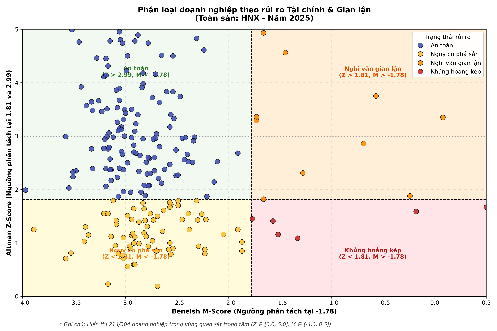
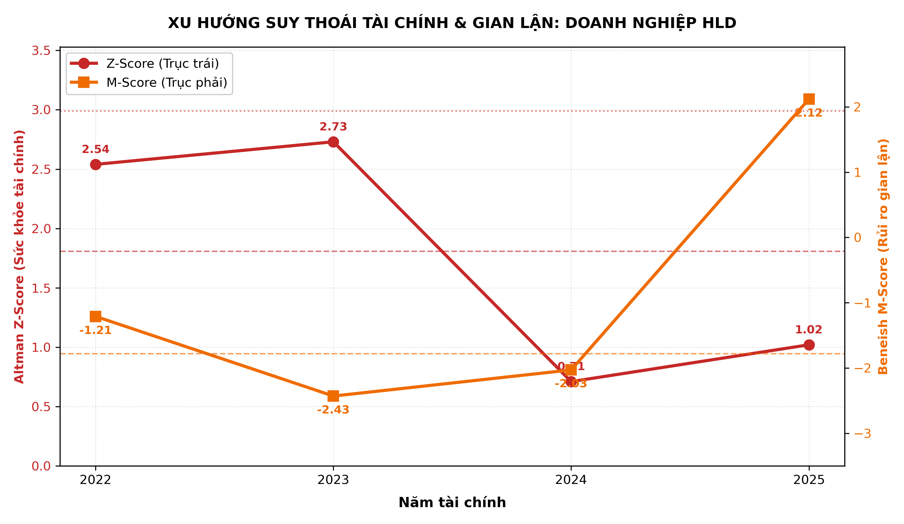
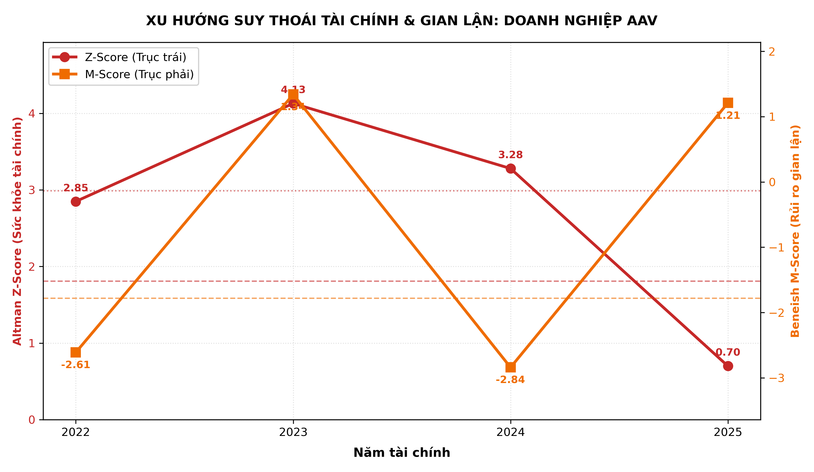

# Corporate Risk Warning System

[](https://www.python.org/)
[](LICENSE)
[]()

Quantitative early-warning engine detecting financial distress and financial statement manipulation for listed companies via **Altman Z-Score** and **Beneish M-Score**.

---

## 1. 4-Quadrant Risk Matrix



### Framework

| Quadrant | Condition | Classification | Visual Identifier |
| :--- | :--- | :--- | :---: |
| **Top-Left** | $Z \ge 1.81 \land M < -1.78$ | Safe (An toàn) | Blue Dot |
| **Top-Right** | $Z \ge 1.81 \land M \ge -1.78$ | Manipulation Risk (Nghi vấn gian lận) | Orange Dot |
| **Bottom-Left** | $Z < 1.81 \land M < -1.78$ | Bankruptcy Risk (Nguy cơ phá sản) | Yellow Dot |
| **Bottom-Right** | $Z < 1.81 \land M \ge -1.78$ | Double Crisis (Khủng hoảng kép) | Red Dot |

---

## 2. Financial Distress Trendlines

Dual-axis tracking of solvency decay ($Z \downarrow$) against earnings manipulation surge ($M \uparrow$):

| HLD (HNX) | AAV (HNX) |
| :---: | :---: |
|  |  |

---

## 3. Market Distribution (HNX 2025)

| Metric | Threshold | Count | Share |
| :--- | :--- | :---: | :---: |
| **Z-Score Safe** | $Z > 2.99$ | 139 | 45.7% |
| **Z-Score Grey** | $1.81 \le Z \le 2.99$ | 76 | 25.0% |
| **Z-Score Distress** | $Z < 1.81$ | 89 | 29.3% |
| **M-Score Non-Manipulator** | $M \le -1.78$ | 260 | 85.5% |
| **M-Score Manipulator** | $M > -1.78$ | 44 | 14.5% |
| **Combined: Double Crisis** | $Z < 1.81 \land M \ge -1.78$ | 16 | 5.3% |

---

## 4. Quantitative Formulation

### Altman Z-Score (1968)
$$Z = 1.2 X_1 + 1.4 X_2 + 3.3 X_3 + 0.6 X_4 + 0.999 X_5$$
- $X_1 = \text{Working Capital} / \text{Total Assets}$
- $X_2 = \text{Retained Earnings} / \text{Total Assets}$
- $X_3 = \text{EBIT} / \text{Total Assets}$
- $X_4 = \text{Book Equity} / \text{Total Liabilities}$
- $X_5 = \text{Net Sales} / \text{Total Assets}$

### Beneish M-Score (5-Variable Model)
$$M = -6.065 + 0.823 \times \text{DSRI} + 0.906 \times \text{GMI} + 0.593 \times \text{AQI} + 0.717 \times \text{SGI} + 0.107 \times \text{DEPI}$$

---

## 5. Repository Structure

```
risk-warning-system/
├── config.py                   # Exchange & historical timeframe configuration
├── finance_models.py           # Vectorized Z-Score & M-Score computation
├── visualizer.py               # 4-quadrant scatter & dual-axis trendline generator
├── main.py                     # Financial data pipeline & report runner
├── requirements.txt            # Dependency manifest
├── BaoCao_RuiRo_HNX_2025/      # HNX Excel datasets & high-res chart exports
└── BaoCao_RuiRo_HSX_2025/      # HSX Excel datasets & high-res chart exports
```

---

## 6. Quickstart

```bash
# 1. Clone
git clone https://github.com/huy01197/risk-warning-system.git
cd risk-warning-system

# 2. Install
pip install -r requirements.txt

# 3. Execute
python main.py
```
