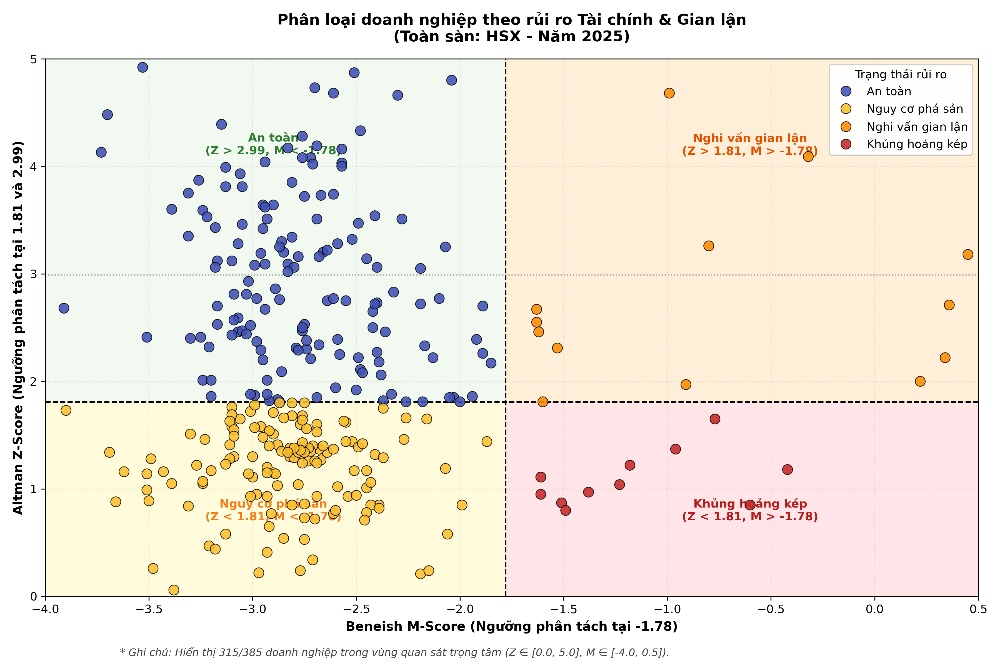
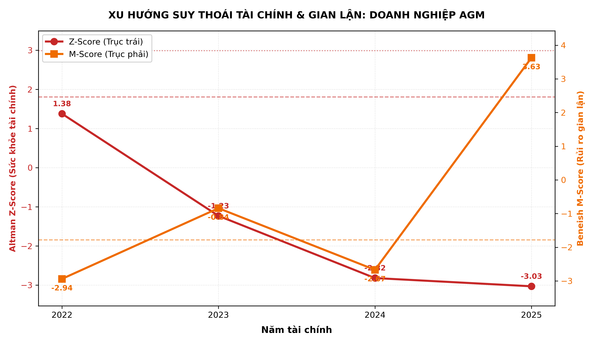
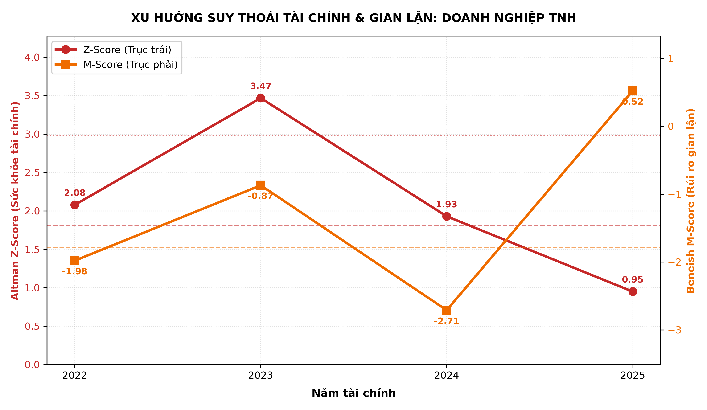

# Hệ Thống Cảnh Báo Sớm Rủi Ro Doanh Nghiệp

[](https://www.python.org/)
[](LICENSE)
[]()

Công cụ định lượng phát hiện sớm nguy cơ kiệt quệ tài chính và rủi ro thao túng báo cáo tài chính của doanh nghiệp niêm yết qua mô hình kết hợp **Altman Z-Score** và **Beneish M-Score**.

---

## 1. Ma Trận Rủi Ro Bốn Góc Phần Tư



### Khung Phân Loại

| Góc phần tư | Điều kiện biên | Trạng thái rủi ro | Nhận diện biểu đồ |
| :--- | :--- | :--- | :---: |
| **Trên - Trái** | $Z \ge 1.81 \land M < -1.78$ | An toàn | Chấm xanh dương |
| **Trên - Phải** | $Z \ge 1.81 \land M \ge -1.78$ | Nghi vấn gian lận | Chấm cam |
| **Dưới - Trái** | $Z < 1.81 \land M < -1.78$ | Nguy cơ phá sản | Chấm vàng |
| **Dưới - Phải** | $Z < 1.81 \land M \ge -1.78$ | Khủng hoảng kép | Chấm đỏ |

---

## 2. Xu Hướng Suy Thoái Tài Chính

Đồ thị trục kép (Dual-axis) phản ánh quá trình suy giảm khả năng thanh toán ($Z \downarrow$) song hành cùng rủi ro thao túng số liệu gia tăng ($M \uparrow$):

| Doanh nghiệp AGM (HSX) | Doanh nghiệp TNH (HSX) |
| :---: | :---: |
|  |  |

---

## 3. Thống Kê Phân Bố Rủi Ro (Toàn sàn HSX - Năm 2025)

| Chỉ tiêu phân loại | Ngưỡng lý thuyết | Số lượng DN | Tỷ trọng (%) |
| :--- | :--- | :---: | :---: |
| **Z-Score: Vùng an toàn** | $Z > 2.99$ | 129 | 33.5% |
| **Z-Score: Vùng xám** | $1.81 \le Z \le 2.99$ | 91 | 23.6% |
| **Z-Score: Vùng nguy hiểm** | $Z < 1.81$ | 165 | 42.9% |
| **M-Score: Ít khả năng thao túng** | $M \le -1.78$ | 346 | 89.9% |
| **M-Score: Nguy cơ thao túng cao** | $M > -1.78$ | 39 | 10.1% |
| **Tổng hợp: Khủng hoảng kép** | $Z < 1.81 \land M \ge -1.78$ | 15 | 3.9% |

---

## 4. Công Thức Định Lượng

### Mô hình Altman Z-Score (1968)
$$Z = 1.2 X_1 + 1.4 X_2 + 3.3 X_3 + 0.6 X_4 + 0.999 X_5$$
- $X_1 = \text{Vốn lưu động} / \text{Tổng tài sản}$
- $X_2 = \text{Lợi nhuận giữ lại} / \text{Tổng tài sản}$
- $X_3 = \text{EBIT} / \text{Tổng tài sản}$
- $X_4 = \text{Vốn chủ sở hữu} / \text{Nợ phải trả}$
- $X_5 = \text{Doanh thu thuần} / \text{Tổng tài sản}$

### Mô hình Beneish M-Score (5 biến số)
$$M = -6.065 + 0.823 \times \text{DSRI} + 0.906 \times \text{GMI} + 0.593 \times \text{AQI} + 0.717 \times \text{SGI} + 0.107 \times \text{DEPI}$$

---

## 5. Cấu Trúc Mã Nguồn

```
risk-warning-system/
├── config.py                   # Cấu hình sàn giao dịch (HNX/HSX) và chuỗi năm
├── finance_models.py           # Thuật toán tính toán vector hóa Z-Score & M-Score
├── visualizer.py               # Module vẽ Scatter 4 góc và Trendline trục kép
├── main.py                     # Pipeline nạp dữ liệu BCTC và xuất báo cáo
├── requirements.txt            # Danh mục thư viện phụ thuộc
├── BaoCao_RuiRo_HNX_2025/      # Kết quả Excel & biểu đồ PNG sàn HNX
└── BaoCao_RuiRo_HSX_2025/      # Kết quả Excel & biểu đồ PNG sàn HSX
```

---

## 6. Hướng Dẫn Thực Thi

```bash
# 1. Tải mã nguồn
git clone https://github.com/huy01197/risk-warning-system.git
cd risk-warning-system

# 2. Cài đặt môi trường
pip install -r requirements.txt

# 3. Chạy hệ thống
python main.py
```
